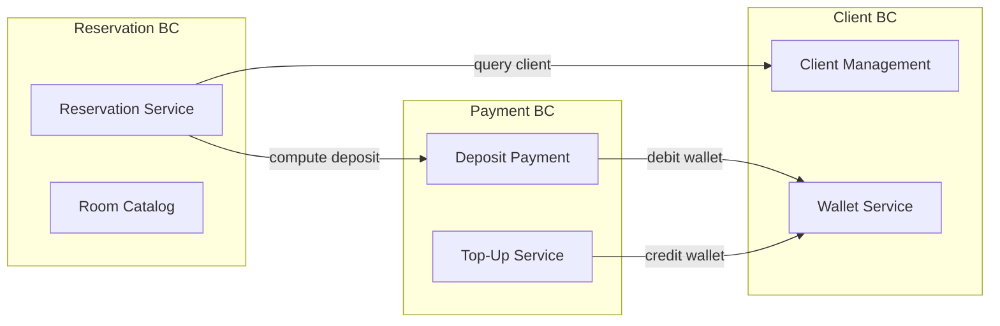
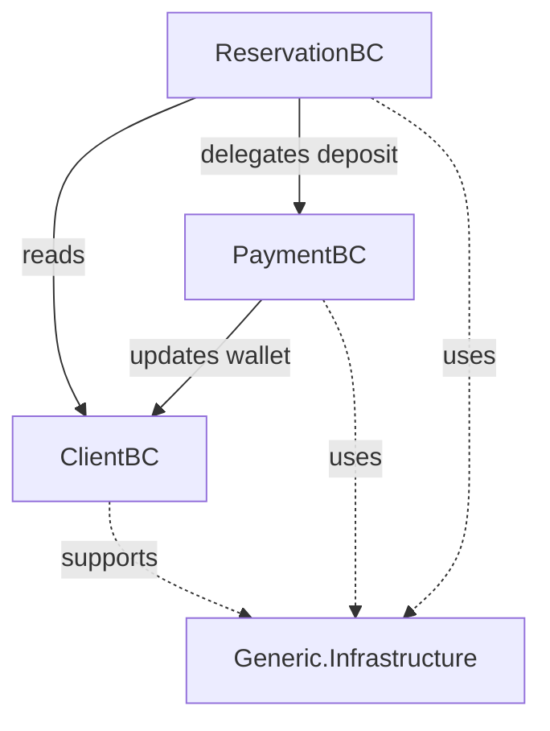

## Installation

```bash
git clone https://github.com/DuskGTB/ddd-5AL.git
cd ddd-5AL
```

---

## Commandes Docker

Lancer la base PostgreSQL et l’application :

```bash
docker-compose up -d --build
```

Exécuter la suite de tests :

```bash
docker-compose run --rm test
```

---

## API

- **POST** `/api/clients` — Créer un client  
- **POST** `/api/clients/{client_id}/wallet` — Créditer le wallet  
- **GET**  `/api/rooms` — Lister les types de chambres  
- **POST** `/api/reservations` — Créer une réservation  
- **POST** `/api/reservations/{reservation_id}/deposit` — Payer le dépôt (50 %)  
- **POST** `/api/reservations/{reservation_id}/confirm` — Confirmer (payer solde)  
- **POST** `/api/reservations/{reservation_id}/cancel` — Annuler  

(Voir fichier .http utilisable dans VScode via l'extension REST Client)
---

## Design stratégique

### 1. Ubiquitous Language

- **Client** : utilisateur du système, possède un portefeuille (`Wallet`)  
- **Wallet** : objet de valeur stockant un solde monétaire (`Money`)  
- **Reservation** : agrégat représentant la réservation d’une ou plusieurs chambres  
- **Room** : type de chambre (`standard`, `superior`, `suite`) avec prix et caractéristiques  
- **Money** : montant et devise (`EUR`, `USD`, …)  
- **ClientId / ReservationId** : identifiants forts (UUID)

### 2. Bounded Contexts




### 3. Context Map




### 4. Domain Classification

- **Core Domain**  
  - Reservation Service (gestion des réservations, calcul de montant, confirmation)  
- **Supporting Domain**  
  - Client Management (création de compte, wallet, top-up)  
  - Payment Processing (paiement dépôt, paiement solde)  
- **Generic Domain**  
  - Infrastructure (Flask API, SQLAlchemy, PostgreSQL)  
  - Application Services (cas d’usage)

---
